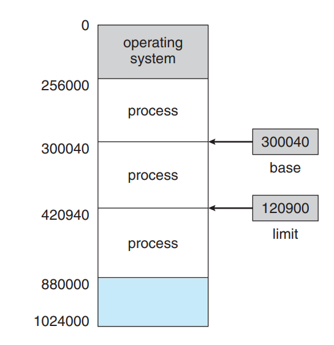
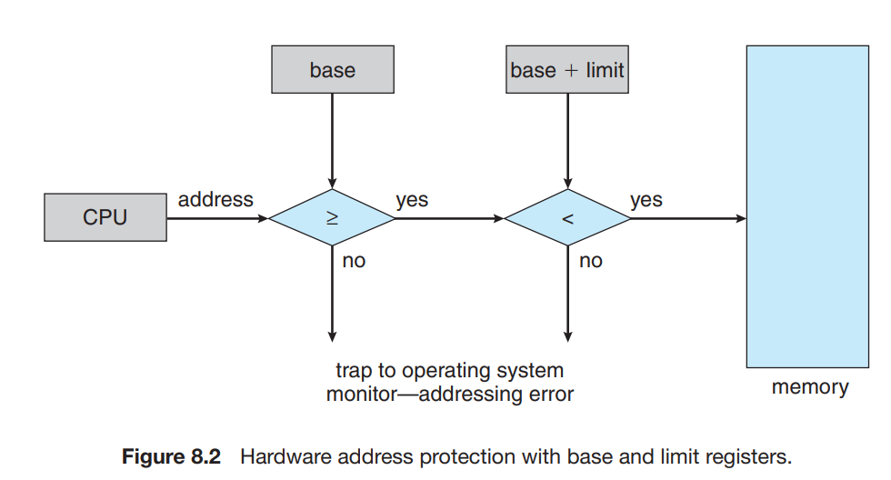
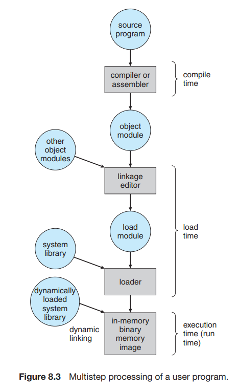

# CH8-1. background
메모리는 현대 컴퓨터 시스템에서 핵심 작업이다. 메모리는 큰 바이트(byte)형태의 배열로 구성되어 있고 각각 주소를 갖는다.   
CPU는 pc(program counter)의 값에 따라서 메모리에서 instruction을 가져옵니다. 이런 instruction은 특정 메모리 주소에서 추가적인 로드, 저장작업을 발생시킬 수 있습니다.

일반적인 instruction의 실행 과정은 아래와 같습니다.

1. instruction이 메모리에서 패치(fetch)됩니다.
2. 패치된 instruction은 Decode 후 메모리에서 피연산자(operand)를 패치해옵니다.
3. 그 후 피연산자에 의해 instruction이 실행되고 실행 결과가 다시 메모리에 저장됩니다.

메모리 유닛은 메모리의 연속됨만 알고 그 외(instruction counter, indexing, indirction, literal address, data / instruction의 생성 방법)은 모릅니다.

## Basic Hardware
> 기호 메모리 주소(symbolic memory address)를 물리 주소(physical address)로 binding 합니다.

메인 메모리와 레지스터는 CPU가 바로 접근할 수 있는 유일한 장치들이다. **기계 명령어(machine instructions)은 메모리 주소만 argument로 취하고** 디스크 주소는 취하지 않습니다. 따라서 실행되는 명령어나 데이터들은 모두 CPU가 직접 접근 가능한 곳에 위치해야하며 그렇지 않은 경우(data가 메모리에 존재하지 않는 경우)엔 CPU는 데이터를 메모리에 옮기는 작업을 수행합니다.

1장에서 CPU의 **cache**에 대해 알아봤다. CPU는 빠른 데이터 접근 속도뿐만 아니라 멀티 유저(프로세스) 환경에서 다른 유저(프로세스)에게 메모리를 침범하지 못하도록 막아야한다. 이 작업은 운영체재가 하지 않고 하드웨어가 담당해야한다. (운영체재는 CPU와 메모리 사이에 존재하는 것이 아니기 때문에 운영체재가 이를 담당할 경우 상당한 손실이 존재한다.)

각 프로세스마다 독립된 메모리 공간을 소유한다. 이는 멀티 프로세스 환경에서 다른 프로세스에 의헤 메모리 영역이 침범당하는 현상을 근본적으로 방어해준다.
이 방법은 CPU의 base, limit 레지스터를 이용해서 구현할 수 있다. 
* Base register : 가장 작은 합법적인 물리 메모리 공간(legal physical memory address)을 보유한다.
* Limit register : 메모리 사용 공간 범위를 명시한다.

위 그림에서 base 레지스터는 300040의 물리 주소 값을 갖는다. limit는 120900이라는 값을 갖는데, 이는 [base, base + limit) - base 이상, base + limit 미만 사이의 메모리 공간을 프로세스가 갖는다는 의미이다.
즉 프로세스는 300040 ~ 420939의 공간을 독점적으로 소유한다.   
 
 

그림 8.2를 통해 이 두 레지스터가 어떻게 다른 프로세스의 메모리 침범을 막는지를 보여준다.    
   
base, limit 레지스터는 오직 운영체제의 특권 명령(privileged instruction)만 로드할 수 있다. 이 명령은 커널 모드에서만 실행되어 사용자는 이 값을 수정할 수 없다.   
   
운영체제는 커널 영역에서 실행되며 운영체재의 메모리 공간과 사용자의 메모리 공간에 제약없이 접근할 수 있다. 이 특성 덕분에 운영체재가 사용자 메모리를 로드, 오류 발생 시 덤프(Dump)를 기록하거나, 시스템 콜(system call)의 매개변수를 수정하는 작업, 사용자 메모리 공간에서 I/O작업 실행 등을 할 수 있다.
또 Context-switch에서 실행중인 작업의 레지스터를 메인 메모리에 저장하는 것도 가능하게 해준다.

## Address Binding
일반적으로 프로그램은 디스크에 실행 가능한 이진파일 형태로 저장되어 있다. 프로그램이 실행될 때 디스크에서 메모리로 로드되며 실행중인 프로그램은 **프로세스**라고 부른다.   
메모리 관리에 의해 프로세스는 디스크와 메모리를 왔다갔다 할 수 있다. 디스크에서 메모리로 로드되기를 기다리는 프로세스들은 **input queue가 관리**한다.   
   
대부분의 시스템들은 유저 프로세스마다 물리 메모리를 부분적으로 할당해준다. 프로세스 메모리의 시작주소가 00000라고 해도 실제 물리 메모리는 00000부터 시작하지 않는다. 이 방법은 뒤에 기술한다.

**[사용자 프로그램의 실행 과정]**     

이 단계에서 주소는 다른 방식으로 표기될 수 있다.   
1. 소스 프로그램 (source file)에서 주소는 symbolic (int count 같은 변수)이다.
2. 컴파일러가 symbolic 주소를 상대적(relocatable) 주소로 **바인드**(시작 주소부터 14byte같은 방법)한다.
3. 링커(Linkage deitor or loader)가 상대적 주소를 물리적 주소로 **바인드(Bind)**한다.

메모리가 바인딩되는 시점에 따라 바인딩 기법은 3가지로 분류한다.
* Compile time : 컴파일 시점에 필요한 메모리 위치를 아는 경우 절대 코드(absolute code) 생성
    - 예를 들어 새로운 프로세스의 시작 위치(starting location)가 300400인 경우
    - MS-DOS의 .COM 포맷 프로그램이 이에 속한다.
* Load time : compile time에 메모리의 시작 위치를 모르는 경우 컴파일러는 상대적 위치를 생성하고 바인딩을 load time까지 미룬다. 만약 시작 주소가 바뀐 경우 변경된 값을 포함한 유저 코드만 다시 로드(reload) 한다.
* Execution time : 만약 프로세스가 실행중에 메모리 세그먼트를 다른 위치로 변경하는 경우 바인딩은 run time까지 미뤄진다. 이 작업은 하드웨어의 지원이 필요하며 현대의 컴퓨터 시스템은 대부분 이 바인딩 기법을 사용한다.

[log]
- 2020/08/31 ~Address binding까지 작성