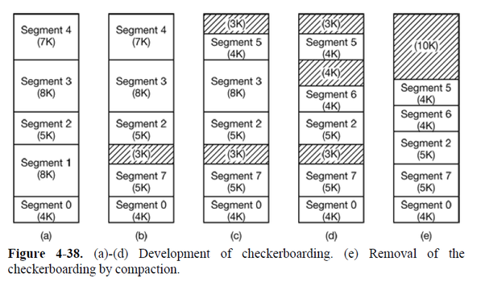
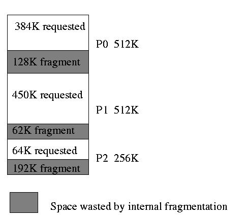

# 연속 메모리 할당 (Contiguous Memory Allocation)
메모리는 운영체제가 상주하는 부분과 유저 프로세스가 상주하는 부분 총 2부분으로 분리할 수 있다. 운영체제는 low memory(kernel), high memory(user)영역에 모두 위치할 수 있지만 운영체제의 위치는 interrupt vector의 위치를 따라간다. interrupt vector는 주로 low memory영역에 존재하기 때문에 개발자는 운영체제 또한 low memory 영역에 상주시킨다. 이 책에선 운영체제가 low memory에 존재하는 상황이라고 정했다.

사용자들은 동시에 여러 프로그램을 메모리에 상주시키길 원한다. 이를 위해서 input queue에 대기중인 프로세스들에게 가용 메모리 할당해주는 방법을 고민해야한다. **Contiguous Memory Allocation (이하 연속 메모리 할당)**에서는 각 프로세스마다 다음 프로세스의 섹션과 인접한 메모리 섹션을 한 개씩 가지고 있다.

## Memory Protection
Chapter 8-1에서는 relocation register, limit register를 이용해 memory protection하는 방법을 간단하게 알아봤었다. 

1. 논리적 주소를 limit register를 이용해 허용 범위인지 체크한다.
2. MMU를 통해 논리적 주소 + relocation register 계산을 해준다.
3. 매핑된 주소 (logical address + relocation register)를 메모리에 전송한다.

논리적 주소를 물리적 메모리 주소로 변경하는 과정은 위와 같다.

CPU 스케쥴러가 실행할 프로세스를 선택할 때 context-switch의 일부로 dispatcher가 relocation register, limit register의 값을 불러온다. 이유는 CPU가 생성한 모든 주소들은 두 레지스터에 의해서 체크되기 때문이다. 이 방법으로 다른 운영체제나 타 사용자 프로그램, 데이터가 실행중인 프로세스에 의해 수정되는 것을 막을 수 있다.

relocation register를 사용해서 효과적으로 운영체제의 크기를 변경 할 수 있다. 예를 들어 운영체제는 디바이스 드라이버에 대한 코드와 버퍼를 가지고 있다. 만약 디바이스 드라이버 혹은 다른 운영체제가 코드, 버퍼를 사용하지 않는다면 메모리에 코드, 데이터가 존재할 필요가 없게 되고 코드, 데이터가 있던 메모리 공간을 다른 목적으로 사용할 수 있다. 이런 방법을 **일시적인 운영체제 코드(transient operating-system code)**라고 한다.

## Memory Allocation
메모리 공간 할당 기법에는 메모리를 고정 크기로 나누는 방법과 가변 크기로 나누는 방법이 있다. 

메모리를 고정된 크기의 파티션으로 나누는 방법은 파티션 개수가 멀티 프로그래밍 수준을 결정한다. 이런 다중 파티션(Multi partition)에서 프로세스가 input queue에서 선택될 때 가용가능한 메모리 공간에 프로세스가 로드된다. 만약 프로세스가 종료된 경우 해당 메모리 공간을 반납하고 다른 프로세스가 이 메모리 공간을 사용할 수 있게된다. 이 방법은 현대에선 사용하지 않는다.

또 다른 방법은 가변 파티션(Variable partition)기법이다. 이 기법을 사용하는 운영체제는 사용중인 메모리 공간들과 사용 가능한 메모리 공간들을 테이블 형식으로 관리하고 있다. 초기 상태에선 사용 가능한 메모리 한 덩어리(hole)가 존재한다. 프로세스가 메모리 공간을 요구한다면 운영체제는 충분한 크기의 덩어리(hole)를 프로세스에 할당해준다. 할당해준 크기가 큰 덩어리에 프로세스가 공간을 할당받고난 나머지 공간은 반환한다. 프로세스는 10mb의 공간이 필요한데 할당받은 메모리가 100mb인 경우 90mb는 운영체제에 다시 반납한다. 프로세스가 종료되면 사용중인 메모리 블록들을 해제해준다. 이 때 해제한 메모리 블록의 근처에 free hole가 있다면 두 공간을 병합(merge)해서 하나의 덩어리(hole)로 만든다. 

가변 파티션 기법에서 프로세스에 필요한 메모리 공간이 부족한 경우 필요한 공간이 마련될 때 까지 대기하거나 현재 프로세스는 대기 상태로 돌려놓고 메모리 요구 공간이 더 작은 프로세스를 탐색해 메모리 할당 처리를 해준다. 

이 기법에서 적합한 메모리 덩어리를 할당해주는 알고리즘은 3가지가 있고 아래와 같다.
1. First fit : 요청을 만족시키는 덩어리 중 첫번째로 발견한 덩어리를 할당해준다. 검색은 덩어리 집합의 처음부터 하거나 이전 탐색의 다음 위치부터 할 수 있다. 
2. Best-fit : 요청을 만족시키는 덩어리 중 가장 작은 공간을 할당해준다. 덩어리 리스트가 정렬되지 않았다면 모든 집합을 순회해야한다. 이 방법은 아주 작은 여유 공간을 만들어 낸다.
3. Worst-fit : 요청을 만족시키는 덩어리 중 제일 큰 공간을 할당해준다. 큰 여유 공간을 만들어내 다른 프로세스가 이 공간을 사용할 수 있다. Best-fit과 같이 덩어리 리스트가 정렬되어있지 않다면 집합 전체를 순회한다. 

First-fit과 Best-fit은 Worst-fit보다 저장효율이나 시간 효율이 좋다. First-fit과 Best-fit 중 저장 효율 우위는 찾기 힘들지만 First-fit이 속도 효율은 더 좋다.

## Fragmentation (단편화)
### 1. 외부 단편화 (External fragmentation)
    프로세스를 할당해 줄 메모리의 공간이 충분하지만 메모리 공간들이 연속된 것이 아닌 군데군데 나뉘어져있어 프로세스를 할당해주지 못하는 문제.

위 그림에서 D가 외부 단편화 문제가 발생한 상황이다. 
외부 단편화에 영향을 주는 요인은 First-fit 알고리즘을 사용하는지 Best-fit알고리즘을 사용하는지와 여유공간이 메모리의 처음과 끝에 위치하는지 유무이다.

>**50% 룰**이라는 것이 있는데 First-fit을 사용할 경우 N개의 블록 중 0.5N개의 블록은 단편화로 사용 불가능 해진다는 통계에서 비롯되었다.

만약 메모리 여유 공간이 1KB가 있고 프로세스의 요구 공간이 1022Byte라면 잔여 공간은 2byte가 남는다. 이 상황에서 2byte 여유 공간의 추적비용이 공간의 가치보다 커져 오버헤드가 발생하는 상황이 존재한다. 이 문제에 대해 간단한 해결 방법으로 물리 메모리를 고정된 크기로 나누고 이 블록 크기 단위로 메모리를 할당해주는 방법이다. 이 방법은 내부 단편화(Internal fragmentation)문제가 있다.

### 2. 내부 단편화 (Internal fragmentation)
    물리메모리를 블럭 단위로 쪼개서 프로세스에 할당해주는 기법에서 발생하며 블록 내부에 사용 안하는 공간이 발생하는 문제이다.

### 3. 압축 (Compaction)
    외부 단편화 문제를 해결해 주는 기법이며 분산된 사용 가능 메모리들을 하나의 덩어리로 만들어 주는 작업이다.
메모리들을 relocation해주는 작업은 load time, assembly같은 정적인 상황에서 불가능하며 execution time같은 동적인 상황에서만 가능하다. 프로세스 메모리와 데이터를 옮길 땐 각 프로세스의 base register의 값만 수정해주면 된다. 

relocation algorithm엔 2가지 방법이 있다.
1. 간단한 방법인데 모든 프로세스를 메모리의 끝으로 이동시키고 사용 가능 공간들은 반대 방향의 끝으로 이동시키는 방법이다. 매우 비용이 높다는 단점이 있다.
2. 외부 단편화를 허용하는 방법인데, 논리적 공간을 비연속적 공간(외부 단편화)이 되도록 허용하고 물리 메모리의 가용공간을 프로세스에 할당하는 작업이다. 이를 위한 상호보완적인 기법으로 세그먼테이션과 페이징이 있으며 이 두 기법을 결합해서 사용도 가능하다. 

Fragmentation은 데이터 블록 관리 기법에서는 필연적으로 발생하는 문제이다.

[log]
- 2020/09/07 : ~2. Memory Protection
- 2020/09/10 : complete