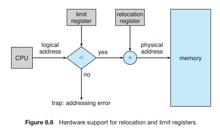

# 연속 메모리 할당 (Contiguous Memory Allocation)
메모리는 운영체제가 상주하는 부분과 유저 프로세스가 상주하는 부분 총 2부분으로 분리할 수 있다. 운영체제는 low memory(kernel), high memory(user)영역에 모두 위치할 수 있지만 운영체제의 위치는 interrupt vector의 위치를 따라간다. interrupt vector는 주로 low memory영역에 존재하기 때문에 개발자는 운영체제 또한 low memory 영역에 상주시킨다. 이 책에선 운영체제가 low memory에 존재하는 상황이라고 정했다.

사용자들은 동시에 여러 프로그램을 메모리에 상주시키길 원한다. 이를 위해서 input queue에 대기중인 프로세스들에게 가용 메모리 할당해주는 방법을 고민해야한다. **Contiguous Memory Allocation (이하 연속 메모리 할당)**에서는 각 프로세스마다 다음 프로세스의 섹션과 인접한 메모리 섹션을 한 개씩 가지고 있다.

## Memory Protection
Chapter 8-1에서는 relocation register, limit register를 이용해 memory protection하는 방법을 간단하게 알아봤었다. 

1. 논리적 주소를 limit register를 이용해 허용 범위인지 체크한다.
2. MMU를 통해 논리적 주소 + relocation register 계산을 해준다.
3. 매핑된 주소 (logical address + relocation register)를 메모리에 전송한다.

논리적 주소를 물리적 메모리 주소로 변경하는 과정은 위와 같다.

CPU 스케쥴러가 실행할 프로세스를 선택할 때 context-switch의 일부로 dispatcher가 relocation register, limit register의 값을 불러온다. 이유는 CPU가 생성한 모든 주소들은 두 레지스터에 의해서 체크되기 때문이다. 이 방법으로 다른 운영체제나 타 사용자 프로그램, 데이터가 실행중인 프로세스에 의해 수정되는 것을 막을 수 있다.

relocation register를 사용해서 효과적으로 운영체제의 크기를 변경 할 수 있다. 예를 들어 운영체제는 디바이스 드라이버에 대한 코드와 버퍼를 가지고 있다. 만약 디바이스 드라이버 혹은 다른 운영체제가 코드, 버퍼를 사용하지 않는다면 메모리에 코드, 데이터가 존재할 필요가 없게 되고 코드, 데이터가 있던 메모리 공간을 다른 목적으로 사용할 수 있다. 이런 방법을 **일시적인 운영체제 코드(transient operating-system code)**라고 한다.

[log]
- 2020/09/07 : ~2. Memory Protection