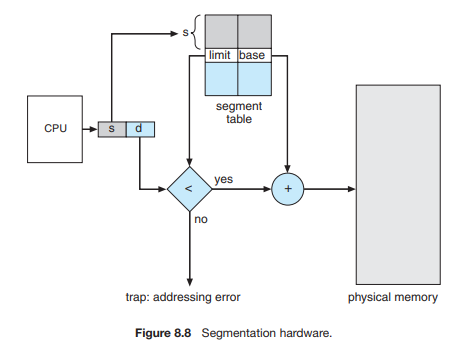

# 세그먼테이션(Segmentation)
세그먼테이션은 하드웨어가 프로그램의 논리적 메모리 주소를 물리적 메모리 주소로 매핑하는 작업을 대신 해주는 기법이다. 덕분에 개발자들은 물리 메모리 공간을 신경쓰지 않고 편리하게 메모리 관리를 해줄 수 있게되었다.

## Basic Method
프로그래머는 자료구조, 라이브러리, 함수, 변수 등을 다룰 때 이들의 메모리 공간이 아니라 이름(name)을 참조한다. 예를 들자면 sqrt()함수가 stack의 앞에 오던 뒤에 오던 프로그래머는 신경쓰지 않는다는 이야기다. 

각 세그먼트의 크기는 프로그램의 목적에 맞게 정의되어 세그먼트마다 크기가 모두 다르다. 세그먼트의 요소(인자)들은 세그먼트의 시작위치에 대한 오프셋(offset)으로 식별된다.
예를 들자면 프로그램의 첫 statement이나 스택의 7번째 프레임, sqrt()함수의 5번째 명령과 같다.

세그먼테이션은 사용자의 메모리를 관리해주는 기법이다. 논리적 메모리 공간은 세그먼테이션의 집합이고 각 세그먼트는 이름과 길이를 가진다. 메모리 주소는 세그먼트의 이름과 세그먼트 내 오프셋을 명시한다. 그래서 논리적 주소는 2투플(two-tuple)로 구성된다.

[segment-number, offset]

일반적으로 컴파일러는 입력 프로그램을 반영해 자동으로 세그먼트를 생성한다. C컴파일러를 예시로 든다면 컴파일러는 코드, 전역변수, 힙 데이터, 스레드별 스택, 라이브러리의 세그먼트를 생성한다. 라이브러리의 경우 컴파일 타임에 링크된다. 로더들은 컴파일 타임에 생성한 각 세그먼트에 세그먼트 번호를 부여해준다.

## Segment Hardward
앞서 우리는 MMU를 이용해 논리적 주소를 물리적 주소로 변환하는 과정을 살펴봤다. 세그먼트에서 사용자 부분은 2차원(segment number, offset)이지만 물리 메모리는 1차원이다. 사용자 부분을 물리적 메모리로 맵핑하기 위해서 **segment table**을 사용한다. 

segment table에는 **segment base**와 **segment limit**가 존재하며 MMU에서 base, limit register와 하는 역할은 같다. 

위 사진에서 s는 segment number, d는 offset을 의미한다. 세그먼트 테이블에서 segment number를 인덱스로 base와 limit값을 가져온다. 이때 사용자의 논리적 주소가 limit를 초과하는지 확인한다. 이유는 프로그래머는 제한 범위를 넘는 값을 가질 수 있기 때문이다. 그 이후 작업은 MMU와 동일하다. 논리적 주소는 0부터 시작하기 때문에 limit로 먼저 체크를 하는 것이 가능하다.

[log]
- 2020/09/12 : segmentation 작성